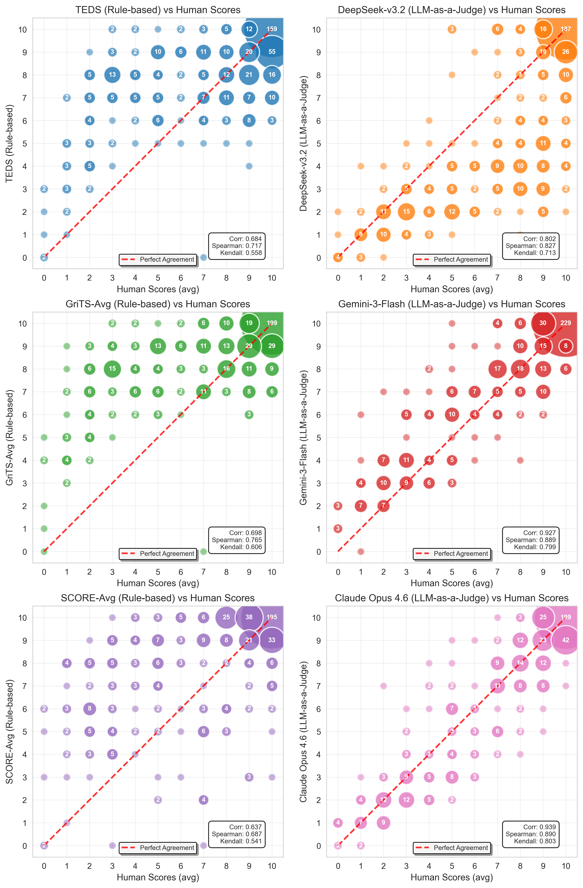

# Table Metric Study

Meta-evaluation of table extraction metrics against human judgment, accompanying the paper:

> **Benchmarking PDF Parsers on Table Extraction with LLM-based Semantic Evaluation**

This repository provides implementations of rule-based table metrics (TEDS, GriTS, SCORE), LLM-as-a-judge scoring, a human evaluation interface, and the correlation analysis used to validate that LLM-based evaluation substantially outperforms rule-based metrics in agreement with human judgment.

## Project Structure

| File | Description |
|---|---|
| `all_tables.json` | Central dataset: ground truth tables, parser extractions, all metric scores, and human ratings |
| `compute_metrics.py` | Compute rule-based metrics (TEDS, GriTS, SCORE) for all extractions |
| `compute_llm_scores.py` | LLM-as-a-judge scoring via OpenRouter API |
| `latex_to_html_claude.py` | Convert LaTeX ground truth tables to HTML (required by rule-based metrics) |
| `human_eval.py` | Gradio web UI for human annotation (0–10 scoring) |
| `correlation_analysis.py` | Correlation analysis and scatter plots (generates paper figures) |
| `scorers/` | Metric implementations (TEDS, GriTS, SCORE, table normalization) |

## Setup

Requires Python 3.12+ and [uv](https://docs.astral.sh/uv/).

```bash
uv sync
```

System dependencies for rule-based metrics and human evaluation UI:
- `pdflatex` and `pdftoppm` (e.g., via TeX Live)
- `latexmlc` (for LaTeX-to-HTML normalization)

Create a `.env` file with API keys:
```
ANTHROPIC_API_KEY=...
OPENROUTER_API_KEY=...
```

## Usage

All scripts can be run via `uv run python <script>.py`.

## Results

The dataset includes over 1,500 human quality ratings on 518 table pairs. The correlation analysis shows that LLM-based judges achieve substantially higher agreement with human judgment than rule-based metrics:



## Data Format

Each entry in `all_tables.json` pairs a ground truth table with its parser extractions, metric scores, and human ratings:

```json
{
  "gt_id": "000_00",
  "gt_table": "\\begin{tabular}...",
  "gt_table_html": "<table>...</table>",
  "complexity": "simple | moderate | complex",
  "extractions": [
    {
      "parser": "gemini_3_flash",
      "extracted_table": "...",
      "metrics": { "teds": 0.91, "grits_top": 0.89, "grits_con": 0.87, ... },
      "llm_scores": [
        { "judge_model": "google/gemini-3-flash-preview", "score": 9, "errors": [...] }
      ],
      "human_scores": [8, 8, 7]
    }
  ]
}
```